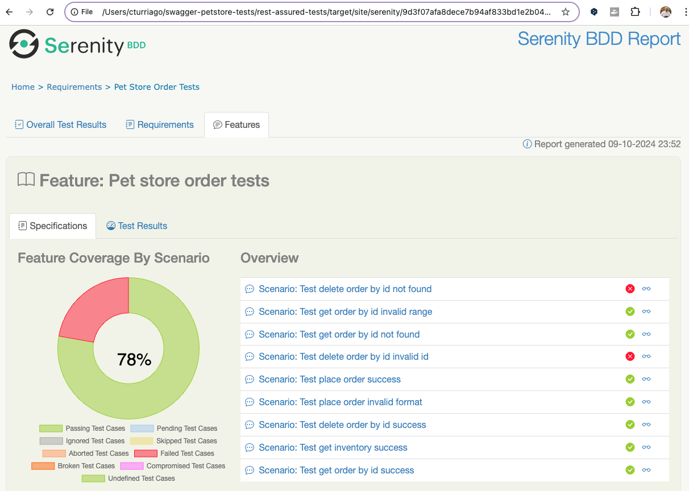
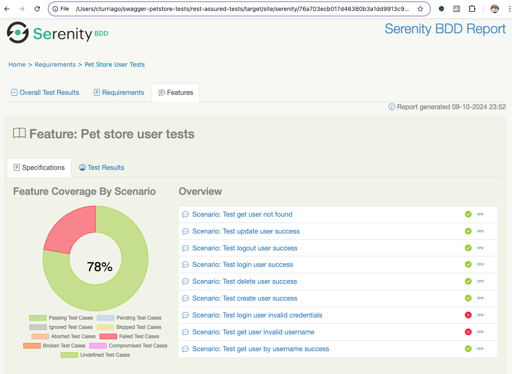

## API Test Automation for Swagger Petstore

### Introduction
This project is an automated test suite for the Swagger Petstore API, implemented using Kotlin. The tests cover a variety of operations related to pets, users, and orders within the Petstore. The goal of this project is to provide a reliable framework to validate that the API behaves as expected, including handling both valid and invalid scenarios.

### Tools and Technologies
- **Serenity BDD**: Used for generating rich reports and managing test execution.
- **Rest-Assured**: Integrated with Serenity for API testing.
- **JUnit 4**: Used as the testing framework to execute and manage test cases.
- **Gradle**: Build and dependency management tool.

### Project Structure
- `src/test/kotlin`: Contains all the test classes.
  - `PetStorePetTests.kt`: Contains tests related to pet operations (add, update, delete, search).
  - `PetStoreUserTests.kt`: Contains tests related to user operations (create, update, delete, login).
  - `PetStoreOrderTests.kt`: Contains tests related to order operations (place order, delete, retrieve).
- `build.gradle.kts`: Build configuration file for Gradle.
- `README.md`: Project documentation.

### How to Run the Tests
1. **Clone the Repository**:
   ```sh
   git clone <repository_url>
   cd petstore-automation
   ```

2. **Run the Tests**:
   - To run all tests:
     ```sh
     ./gradlew test
     ```
   - To generate a Serenity report:
     ```sh
     ./gradlew aggregate
     ```
   - After running the tests, you can find the Serenity report in `target/site/serenity`.

## List of Test Cases
The test cases for Petstore operations are defined as follows:

### Complete List of Test Cases for PetStorePetTests

| **Test Case ID** | **Test Case Description** | **Expected Result** |
|------------------|---------------------------|---------------------|
| 1                | Successfully create a new pet with ID 1004. | Status code 200 or 201, and the pet should be created successfully. |
| 2                | Update a pet with an invalid ID. | Status code 400, and an error message indicating the ID is invalid should be returned. |
| 3                | Update an existing pet (ID 1003) with valid data. | Status code 200, and the pet details should be updated correctly. |
| 4                | Delete an existing pet (ID 1003). | Status code 200, and the pet should be deleted successfully. |
| 5                | Find a non-existing pet by ID (ID 9999). | Status code 404 indicating that the pet was not found. |
| 6                | Add a new pet with invalid input data. | Status code between 400 and 499, and an error message indicating a problem with the input data should be returned. |
| 7                | Update a non-existing pet (ID 9999). | Status code 404 indicating that the pet was not found. |
| 8                | Update an existing pet (ID 1003) with an invalid status. | Status code 405 indicating a validation error as the status is not valid. |
| 9                | Find a pet by existing ID (ID 1003). | Status code 200, and the pet details should be returned successfully. |
| 10               | Upload an image for an existing pet (ID 1003). | Status code 200 or 415, and the image should be uploaded successfully or return an error indicating an unsupported media type. |
| 11               | Attempt to upload an image for a non-existing pet (ID 9999). | Status code 404, 400, or 415 indicating that the pet was not found or that the media type is not supported. |
| 12               | Delete a non-existing pet (ID 9999). | Status code 404 indicating that the pet was not found. |
| 13               | Find pets by status (status "available"). | Status code 200, and the pets with the specified status should be returned. |


### Complete List of Test Cases for PetStoreOrderTests
| **Test Case ID** | **Test Case Description** | **Expected Result** |
|------------------|---------------------------|---------------------|
| 1                | Successfully place a new order for a pet. | Status code 200 or 201, and the order should be placed successfully. |
| 2                | Retrieve an existing order by ID (valid order ID). | Status code 200, and the correct order details should be returned. |
| 3                | Retrieve a non-existing order by ID (invalid order ID). | Status code 404 indicating that the order was not found. |
| 4                | Delete an existing order by ID. | Status code 200, and the order should be deleted successfully. |
| 5                | Delete a non-existing order by ID. | Status code 404 indicating that the order was not found. |
| 6                | Attempt to place an order with invalid data (e.g., negative quantity). | Status code 400, and an error message indicating invalid input should be returned. |
| 7                | Retrieve all orders in the store. | Status code 200, and a list of orders should be returned. |
| 8                | Place an order with a very large quantity. | Status code 400, and an error message indicating invalid quantity should be returned. |
| 9                | Cancel an order by ID (valid order ID). | Status code 200, and the order should be marked as canceled successfully. |

### Complete List of Test Cases for PetStoreUserTests
| **Test Case ID** | **Test Case Description** | **Expected Result** |
|------------------|---------------------------|---------------------|
| 1                | Successfully create a new user with username "testuser". | Status code 200, and the user should be created successfully. |
| 2                | Retrieve an existing user by username "testuser". | Status code 200, and the correct user details should be returned. |
| 3                | Update an existing user with valid data. | Status code 200, and the user details should be updated successfully. |
| 4                | Delete an existing user by username "testuser". | Status code 200, and the user should be deleted successfully. |
| 5                | Log in with valid credentials for user "testuser". | Status code 200, and the login should be successful. |
| 6                | Log out an existing user. | Status code 200, and the user should be logged out successfully. |
| 7                | Attempt to log in with invalid credentials for user "baduser". | Status code 400, and an error message indicating invalid credentials should be returned. |
| 8                | Retrieve a user by invalid username "invalid!username". | Status code 400, and an error message indicating invalid username should be returned. |
| 9                | Retrieve a non-existing user by username "nonexistentuser". | Status code 404, indicating that the user was not found. |

### Test Coverage and Results

### Serenity Report

The detailed Serenity test report can be accessed [here](https://<tu_usuario>.github.io/<tu_repositorio>/target/site/serenity/index.html).

#### Test Results: All Tests


#### Functional Coverage Overview


#### Functional Coverage Details

| **Feature**            | **Scenarios** | **Test Cases** | **% Pass** | **Result** | **Coverage** |
| ---------------------- | ------------- | -------------- | ---------- | ---------- | ------------ |
| Pet store order tests  | 9             | 9              | 78%        | ❌          |  |
| Pet store pet tests    | 13            | 13             | 92%        | ❌          |  |
| Pet store user tests   | 9             | 9              | 78%        | ❌          |  |

### Implementation Overview
- The tests are designed following **Given-When-Then** structure to ensure clarity.
- **Serenity** is used for easy reporting, which allows us to see detailed information about the request and response for each test.
- The tests cover both **positive** and **negative** scenarios to validate the robustness of the API.

### Key Features
- **Detailed Reporting**: The generated Serenity reports provide comprehensive information for each test, including steps, expected vs actual results, and error messages when applicable.
- **Extensible Framework**: The test suite is structured in a way that allows easy addition of new tests, making it scalable as new features or endpoints are added to the API.

### How to Contribute
1. Fork the repository.
2. Create a feature branch:
   ```sh
   git checkout -b feature/new-feature
   ```
3. Commit your changes and push to GitHub.
4. Create a Pull Request.

